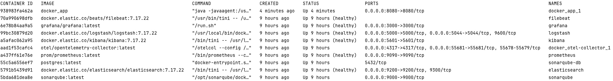
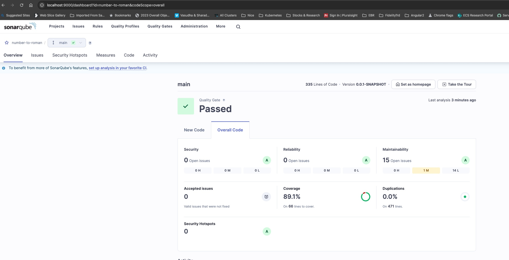

# Spring Boot - Number to Roman Conversion with Monitoring and Logging
This project demonstrates a Spring Boot application that converts numbers to Roman numerals. It includes monitoring and logging integrations using Grafana, Prometheus, and the ELK (Elasticsearch, Logstash, Kibana) stack.

## **Developer**
**Name**: Jayakesavan Muthazhagan<br/>
**Contact**: kesavan.gm@gmail.com

## Table of Contents
1. [Project Architecture](#1-project-architecture)
2. [Pre-requisites](#2-pre-requisites)
3. [Install & Setup](#3-install-steps-to-set-up-project)
4. [Credentials](#4-credentials)
5. [All Service Endpoint Details](#5-all-service-endpoint-details)
6. [Run Test](#6-run-test)
7. [Clean up Docker](#7-clean-up-docker)
8. [References](#8-references)

## 1. **Project Architecture**
## 2. **Pre-requisites**
Before you begin, ensure you have met the following requirements:

- Docker and Docker Compose installed
- Java Development Kit (JDK) 17 or higher
- Maven for building the Spring Boot application
  Basic understanding of Spring Boot, Docker, and monitoring/logging tools
## 3. **Install steps to set up Project**
  1. **Clone the Repository**
      ```bash
      git clone https://github.com/jmuthazh/number-to-roman.git
      cd number-to-roman
     ```
  2. **Build the project:**

      ```bash
      mvn clean install -U
      ```

  3. **Build and run the Docker container:**

      ```bash
      docker-compose -f docker/docker-compose.yml up  -d --build
     ```
       
  After successful docker deployment, you should see the following containers running
> [!Note]
> Make sure all are containers are healthy, before using the service endpoints.
```bash
docker ps -a
```



## 4. **Credentials**
1. **Sonar Qube**
    ```sh
    http://localhost:9000
    ```
user: admin<br/> password: admin
## 5. **All Service Endpoint Details**
  - **Conversion Service Endpoint**
    - **Swagger:** http://localhost:8080/swagger-ui/index.html
    - **Conversion Service API:**
      - **API for Number:** http://localhost:8080/romannumeral?query=400
      - **API for Range:** http://localhost:8080/romannumeral?min=5&max=100
      [!Note]
      >(Number Range should be from min: >=1, max <= 3999)
    - **Spring Metrics**
      - Spring Actuator: http://localhost:8080/actuator
      - Prometheus: http://localhost:8080/actuator/prometheus
  - **Kibana**: http://localhost:5601/
  - **Grafana**: http://localhost:3000 (admin/admin)
  - **ElasticSearch**: http://localhost:9200/
  - **Log Stash**: http://localhost:9600/_node/stats
  - **Sonar Qube**: http://localhost:9000/ (admin/admin)

## 6. **Run Test**
1. **Junit Testing**
    - [NumberToRomanServiceImplTest.java](src/test/java/com/adobe/convertor/service/impl/NumberToRomanServiceImplTest.java)
    - [NumberToRomanControllerTest.java](src/test/java/com/adobe/convertor/controller/NumberToRomanControllerTest.java)
    - [InputValidationTest.java](src/test/java/com/adobe/convertor/validation/InputValidationTest.java)
    - [NumberToRomanApplicationTest.java](src/test/java/com/adobe/convertor/NumberToRomanApplicationTest.java)
    - [SwaggerConfigTest.java](src/test/java/com/adobe/convertor/config/SwaggerConfigTest.java)
2. **Integration Test**
    - This test runs the end to end integration test and pass actual values to the service.
      -[NumberToRomanIntegrationTest.java](src/integration-test/java/com/adobe/convertor/integration/NumberToRomanIntegrationTest.java)
3. **Sonar Code Coverage**
    ```bash
    docker exec -it docker docker_app_1 /bin/bash
    mvn clean verify sonar:sonar -Dsonar.projectKey='number-to-roman'   -Dsonar.projectName='number-to-roman' -Dsonar.host.url=http://localhost:9000 -Dsonar.token=sqp_5f01fe9dcfb9280aec10e6f71ea9122b1589c6b0
    ```
    Code Coverage Report
    

## 7. **Clean up Docker**
```bash
cd docker
docker-compose down --remove-orphans
```
## 8. **References**
Spring Boot Documentation
Grafana Documentation
Prometheus Documentation
Elasticsearch Documentation
Logstash Documentation
Kibana Documentation
