# Spring Boot - Number to Roman Conversion with Monitoring and Logging

This project demonstrates a Spring Boot application that converts numbers to Roman numerals. It includes monitoring and
logging integrations using Grafana, Prometheus, and the ELK (Elasticsearch, Logstash, Kibana) stack.

## **Developer**

**Name**: Jayakesavan Muthazhagan<br/>
**Contact**: kesavan.gm@gmail.com

## Table of Contents

1. [Project Architecture](#1-project-architecture)
    - 1.1 [Project overview](#11-project-overview)
    - 1.2 [Architecture Diagram](#12-architecture-diagram)
2. [Pre-requisites](#2-pre-requisites)
3. [Install & Setup](#3-install-steps-to-set-up-project)
4. [Credentials](#4-credentials)
5. [All Service Endpoint Details](#5-all-service-endpoint-details)
6. [Junit, Integration Test and Sonarqube CodeCoverage](#6-junit-integration-test-and-sonarqube-codecoverage)
    - 6.1 [Test Scenario's](#61-test-scenarios)
    - 6.2 [Junit Testing](#62-junit-testing)
    - 6.3 [Integration Test](#63-integration-test)
    - 6.4 [Sonar Code Coverage](#64-sonar-code-coverage)
      - 6.4.1 [ Follow the steps to run the Sonar Code Coverage](#641-follow-the-steps-to-run-the-sonar-code-coverage)
7. [Logging & Monitoring - ELK Stack](#7--logging--monitoring---elk-stack)
    - 7.1 [Kibana Dashboard](#71-kibana-dashboard)
8. [Grafana, Prometheus Dashboard & Monitoring](#8--grafana-prometheus-dashboard--monitoring-metrics)
    - 8.1 [Access Grafana](#81-access-grafana)
9. [Shutdown Service & Clean Up](#9-shutdown-service--clean-up-docker)
10. [Project File Layout](#10-project-files-layout)
11. [References](#11-references)

## 1. **Project Architecture**

### 1.1 **Project overview:**

This Spring Boot Application architecture has monitoring, logging, and continuous integration/continuous deployment (
CI/CD) using several tools.
<br/>The main components include:

* OpenTelemetry Collector: For collecting telemetry data.
* Prometheus: For metrics collection.
* Grafana: For visualization.
* Elasticsearch, Logstash, Kibana (ELK stack): For logging and searching.
* SonarQube: For code quality analysis.
* PostgreSQL: As a database for SonarQube.
* Spring Boot Application: The application to be monitored and analyzed.
* Sonar Runner: For running SonarQube analysis.
* Network: A common network for all services to communicate.

### 1.2 **Architecture Diagram**

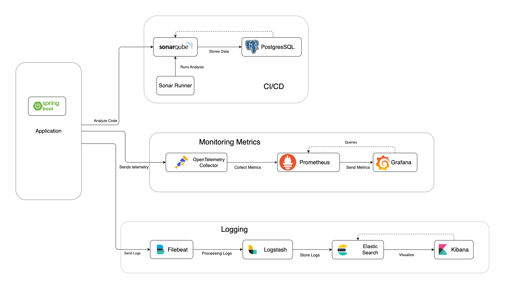

#### **Legends**

- **OpenTelemetry Collector**: Collects telemetry data from the application.
- **Prometheus**: Collects and stores metrics.
- **Grafana**: Visualizes metrics from Prometheus.
- **Elasticsearch**: Stores logs processed by Logstash.
- **Logstash**: Processes and sends logs to Elasticsearch.
- **Kibana**: Visualizes logs stored in Elasticsearch.
- **Filebeat**: Ships logs to Logstash.
- **SonarQube**: Analyzes code quality.
- **PostgreSQL:** Database for SonarQube .
- **Spring Boot App:** The application being monitored and analyzed .
- **Sonar Runner:** Runs SonarQube analysis on the codebase .

## 2. **Pre-requisites**

Before you begin, ensure you have met the following requirements:

- Docker and Docker Compose installed (Docker - 20.10.16, docker-compose version 1.29.2)

```shell
docker version
docker-compose version
```

- Java Development Kit (JDK) 17 or higher (OpenJDK 17)

```shell
java -version
```

- Maven for building the Spring Boot application (Maven - 3.9.8 , SpringBoot - 3.3.2)

```shell
mvn -v
```

- OS used to run this setup: `OS name: "mac os x", version: "12.7.5", arch: "x86_64", family: "mac"`

- Basic understanding of Spring Boot, Docker, and monitoring/logging tools

## 3. **Install steps to set up Project**

1. **Clone the Repository**
    ```bash
    git clone https://github.com/jmuthazh/number-to-roman.git
    cd number-to-roman
   ```
2. **Build the project:**

    ```bash
    mvn clean install -U
    ```

3. **Build and run the Docker container:**

    ```bash
   cd scripts
   ./buildDeploy.sh
   ```

After successful docker deployment, you should see the following containers running
> [!NOTE]
> Make sure all are containers are healthy, before using the service endpoints.

```bash
./checkDockerStatus.sh
```

```sh
         Name                        Command                   State                                        Ports                                 
--------------------------------------------------------------------------------------------------------------------------------------------------
app                       java -javaagent:/usr/src/a ...   Up               0.0.0.0:8080->8080/tcp                                                
docker_otel-collector_1   /otelcol --config /etc/ote ...   Up               0.0.0.0:4317->4317/tcp, 55678/tcp, 55679/tcp, 0.0.0.0:55681->55681/tcp
elasticsearch             /bin/tini -- /usr/local/bi ...   Up (healthy)     0.0.0.0:9200->9200/tcp, 9300/tcp                                      
filebeat                  /usr/bin/tini -- /usr/loca ...   Up (unhealthy)                                                                         
grafana                   /run.sh                          Up (healthy)     0.0.0.0:3000->3000/tcp                                                
kibana                    /bin/tini -- /usr/local/bi ...   Up (healthy)     0.0.0.0:5601->5601/tcp                                                
logstash                  /usr/local/bin/docker-entr ...   Up (healthy)     0.0.0.0:5000->5000/tcp, 0.0.0.0:5044->5044/tcp, 9600/tcp              
prometheus                /bin/prometheus --config.f ...   Up (healthy)     0.0.0.0:9090->9090/tcp                                                
sonar-runner              /usr/local/bin/mvn-entrypo ...   Up                                                                                     
sonarqube                 /opt/sonarqube/docker/entr ...   Up (healthy)     0.0.0.0:9000->9000/tcp                                                
sonarqube-db              docker-entrypoint.sh postgres    Up (healthy)     5432/tcp                                                              
                                         
```

> [!IMPORTANT]
> If you encounter issues with your container not starting or showing errors, make sure to run the `./builDeploy.sh`
script from the `/scripts` folder repeatedly until the problem is resolved.
```shell
ERROR: for app  Container "da423aaae8e0" is unhealthy.
ERROR: Encountered errors while bringing up the project.

```
## 4. **Credentials**

1. **Conversion Service**: http://localhost:8080/romannumeral?query=400 (admin/SuperSecretPass123)
2. **Grafana**: http://localhost:3000 (admin/admin)
2. **Sonar Qube**: http://localhost:9000/ (admin/admin)

## 5. **All Service Endpoint Details**

- **Conversion Service Endpoint**
    - Credential to consume this service: `admin/SuperSecretPass123`
    - **Swagger:** http://localhost:8080/swagger-ui/index.html
      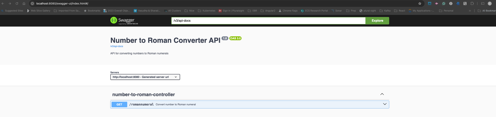
        1. Query API: http://localhost:8080/romannumeral?query=200
        ```shell
        {
        "input": "200",
        "output": "CC"
        }
        ``` 

      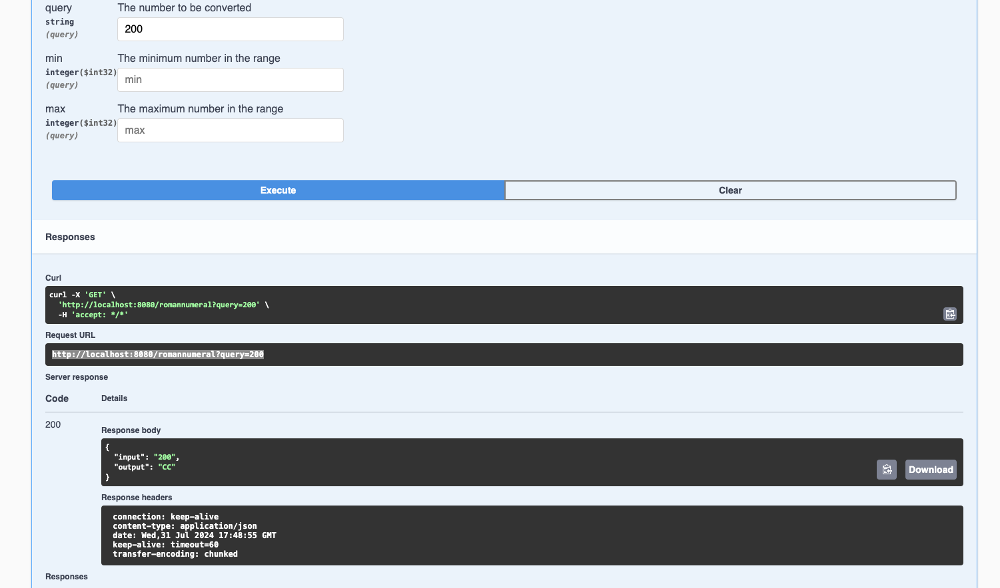
        2. Range API:  http://localhost:8080/romannumeral?min=1&max=3
        ```shell
        {
        "conversions": [
        {
        "input": "1",
        "output": "I"
        },
        {
        "input": "2",
        "output": "II"
        },
        {
        "input": "3",
        "output": "III"
        }
        ]
        }
        ```
      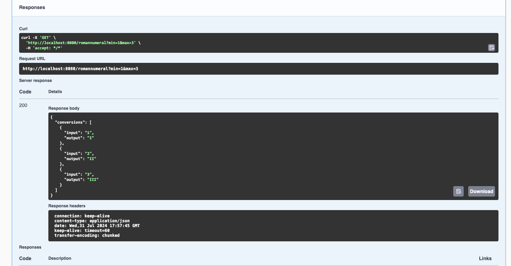

        - **Conversion Service API:**
            - **API for Number:** http://localhost:8080/romannumeral?query=400
            - **API for Range:** http://localhost:8080/romannumeral?min=5&max=100

       [Note:] Number Range should be from min: >=1, max <= 3999)
    - **Spring Metrics**
        - Spring Actuator: http://localhost:8080/actuator
        - Prometheus: http://localhost:8080/actuator/prometheus
- **Kibana**: http://localhost:5601/
- **Grafana**: http://localhost:3000 (admin/admin)
- **ElasticSearch**: http://localhost:9200/
- **Log Stash**: http://localhost:9600/_node/stats
- **Sonar Qube**: http://localhost:9000/ (admin/admin)
- **Prometheus**: http://localhost:9090/

## 6. **Junit, Integration Test and Sonarqube CodeCoverage**

### 6.1 **Test Scenario's**

1. Positive Input:

- http://localhost:8080/romannumeral?query=20
```json
{
    "input": "20",
    "output": "XX"
}
``` 

2. Negative Input:

- http://localhost:8080/romannumeral?query=-11

```json
{
  "statusCode": 400,
  "message": "Number out of range (1-3999): -11",
  "details": "uri=/romannumeral"
}
```

3. Invalid Input:

- http://localhost:8080/romannumeral?query=4000L

```json
{
  "statusCode": 400,
  "message": "Invalid number format: 4000L",
  "details": "uri=/romannumeral"
}
```

3. Positive Range:

- http://localhost:8080/romannumeral?min=3995&max=3999

```json
{
  "conversions": [
    {
      "input": "3995",
      "output": "MMMCMXCV"
    },
    {
      "input": "3996",
      "output": "MMMCMXCVI"
    },
    {
      "input": "3997",
      "output": "MMMCMXCVII"
    },
    {
      "input": "3998",
      "output": "MMMCMXCVIII"
    },
    {
      "input": "3999",
      "output": "MMMCMXCIX"
    }
  ]
}
```

4. Out of Range:

- http://localhost:8080/romannumeral?min=1&max=4000

```json
{
  "statusCode": 400,
  "message": "Invalid range. Ensure min < max and both are in the range 1-3999.",
  "details": "uri=/romannumeral"
}
```

5. High min & Low Max Range:

- http://localhost:8080/romannumeral?min=45&max=40

```json
{
  "statusCode": 400,
  "message": "Invalid range. Ensure min < max and both are in the range 1-3999.",
  "details": "uri=/romannumeral"
}
```

6. Text Input:
- http://localhost:8080/romannumeral?min=1df&max=10
```json
{
  "statusCode": 500,
  "message": "Failed to convert value of type 'java.lang.String' to required type 'java.lang.Integer'; For input string: \"1df\"",
  "details": "uri=/romannumeral"
}
```
7. Number as String:
- http://localhost:8080/romannumeral?min="1"&max="10"
```json
{
  "statusCode": 500,
  "message": "Failed to convert value of type 'java.lang.String' to required type 'java.lang.Integer'; For input string: \"\"1\"\"",
  "details": "uri=/romannumeral"
}
```
8. Number and String:
- http://localhost:8080/romannumeral?min=1&max=string
```json
{
  "statusCode": 500,
  "message": "Failed to convert value of type 'java.lang.String' to required type 'java.lang.Integer'; For input string: \"string\"",
  "details": "uri=/romannumeral"
}
```
9. Query Input as String:
- http://localhost:8080/romannumeral?query="100"
```json
{
  "statusCode": 400,
  "message": "Invalid number format: \"100\"",
  "details": "uri=/romannumeral"
}
```
### 6.2 **Junit Testing**

- [NumberToRomanServiceImplTest.java](src/test/java/com/adobe/convertor/service/impl/NumberToRomanServiceImplTest.java)
- [NumberToRomanControllerTest.java](src/test/java/com/adobe/convertor/controller/NumberToRomanControllerTest.java)
- [InputValidationTest.java](src/test/java/com/adobe/convertor/validation/InputValidationTest.java)
- [NumberToRomanApplicationTest.java](src/test/java/com/adobe/convertor/NumberToRomanApplicationTest.java)
- [SwaggerConfigTest.java](src/test/java/com/adobe/convertor/config/SwaggerConfigTest.java)

### 6.3 **Integration Test**

- This test runs the end to end integration test and pass actual values to the service.
  -[NumberToRomanIntegrationTest.java](src/integration-test/java/com/adobe/convertor/integration/NumberToRomanIntegrationTest.java)

### 6.4 **Sonar Code Coverage**

#### 6.4.1 **Follow the steps to run the Sonar Code Coverage**

1. Login into **SonarQube**: http://localhost:9000/ (admin/admin)
2. **Password Change:**
   - If SonarQube prompts you to change your password, update it to `Sonare@123`. This password should match the one specified in the `docker/.env` file.
   - If you choose a different password, be sure to update the `.env` file accordingly.

3. **Generate** the **sonar token** after changing the password and update the values in `docker/.env` file
```shell
curl -u admin:Sonar@123 -X POST "http://localhost:9000/api/user_tokens/generate?name=test-token"

After a successful execution of above CURL, you should see output similar to the following. Copy the token value and save it in the `docker/.env` file.

{"login":"admin","name":"test-token","token":"dfdfdsfs123456777777dfsfdfdfsdfsdffsdfsdf","createdAt":"2024-08-02T07:07:51+0000","type":"USER_TOKEN"}%    
```
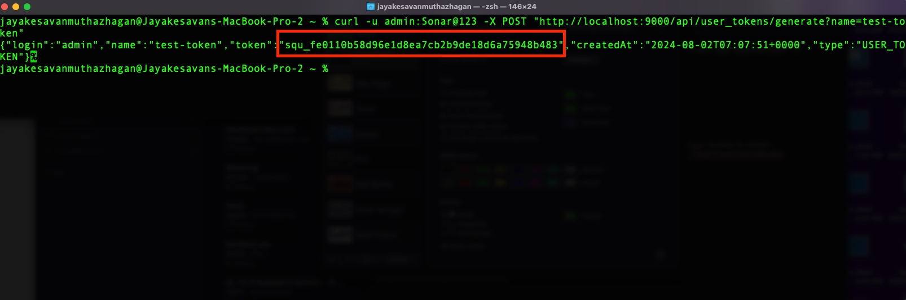


> **Note:** if you have already generated the token, you can skip the following step.
#### **Alternative Method to Generate the Token in SonarQube UI (Skip this if the token has already been generated)**
 
1. Login with same credential as above.  http://localhost:9000/ (admin/Sonar@123)
5. Go to http://localhost:9000/account/security
4. Generate Sonar Qube Token as follows: Enter ***Name, Type, Project, Expires***
   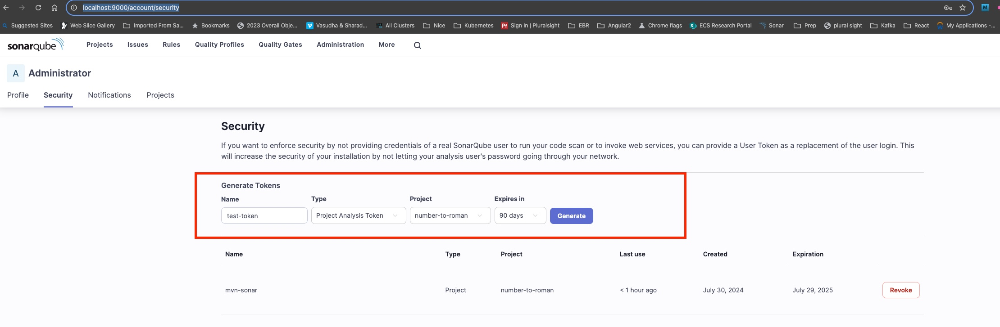
5. Copy the generated token and save it in the [.env](docker/.env) file located at `docker/.env`. 

    ```bash
    SONAR_TOKEN=<token>
    SONAR_USER=admin
    SONAR_PASSWORD=Sonar@123
    ```

  
   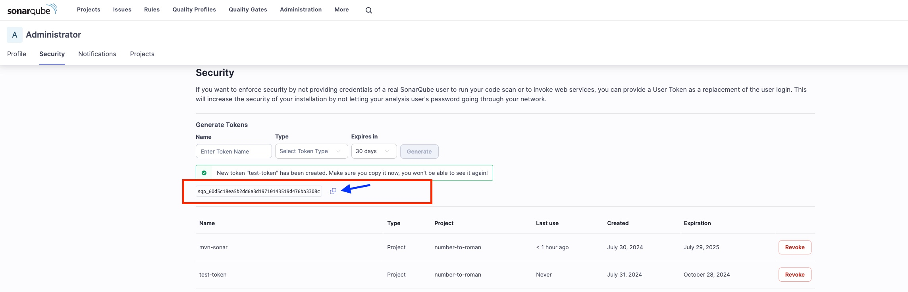


### **Run Sonar Analysis Report**

1. Re-run the `./buildDeploy.sh` script to pass the **generated token** and **new password** to SonarQube. Wait 1 to 3 minutes for the `sonar-runner` state to show `Exit 0`. Verify the state by executing `./checkDockerStatus.sh` to see if the container has exited.

> **Note:** If the Sonar reports are not visible under `Projects > number-to-roman`, continue running `./buildDeploy.sh` until the `sonar-runner` status shows `Up`.


```shell
sonar-runner               /usr/local/bin/mvn-entrypo ...   Exit 0  
```
2. To view Code Coverage Report:
   
   Go to: http://localhost:9000/dashboard?id=number-to-roman&codeScope=overall
  

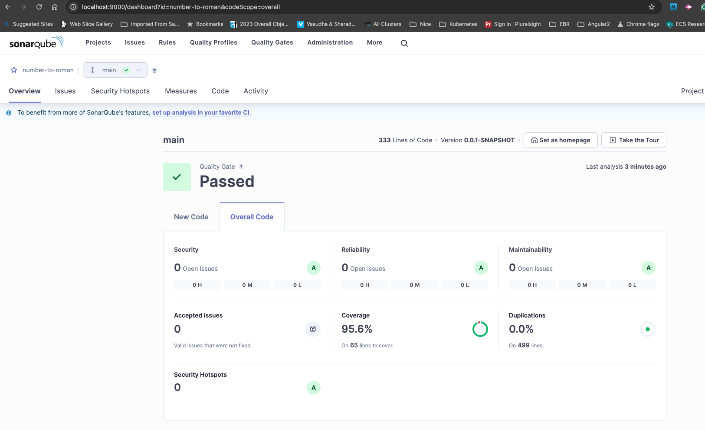

## 7 . **Logging & Monitoring - ELK Stack**

### 7.1 **Kibana Dashboard**

1. Login into Kibana http://localhost:5601/
2. Navigate to this path: http://localhost:5601/app/management/kibana/indexPatterns
3. Click on ***Create index pattern***
   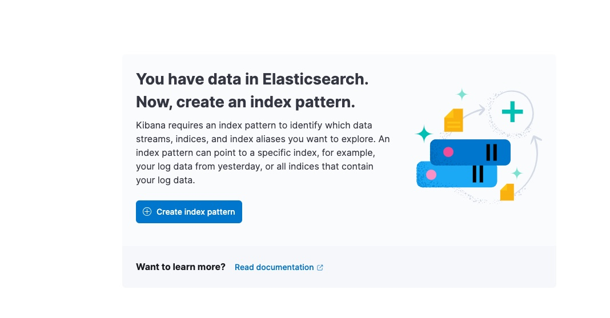
4. Enter the name as `logstash-*` and select Timestamp field as `@timestamp` , click on Create Index pattern.
   Follow the sequence in the screenshot
   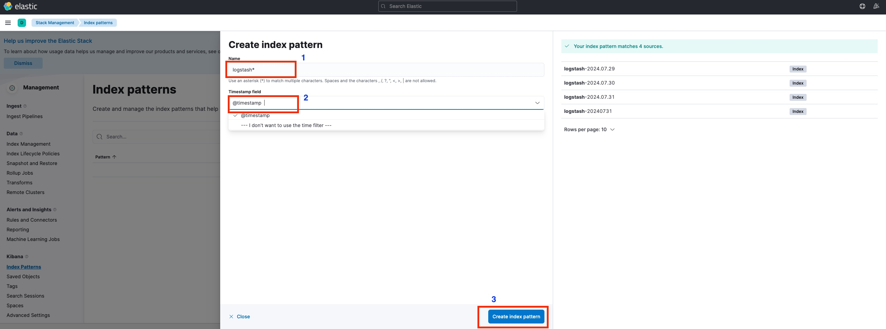
5. Navigate to this url to view Dashboard : http://localhost:5601/app/discover
6. **Kibana Dashboard View**
   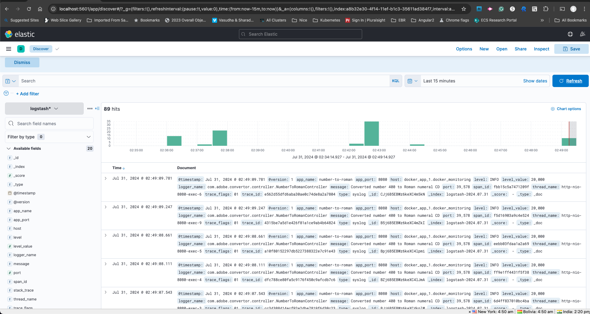

## 8 . **Grafana, Prometheus Dashboard & Monitoring Metrics**

### 8.1 **Access Grafana**

1. Login into http://localhost:3000
2. UserId: admin , Password: admin
3. Navigate to the `/Dashboards` folder on the left side and look for the `Dashboards` folder within it.

> [!IMPORTANT]
> ***[ Home >   Dashboards >   Dashboards ]***

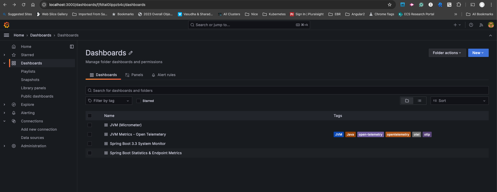

4. Open **JVM Micrometer** dashboard
   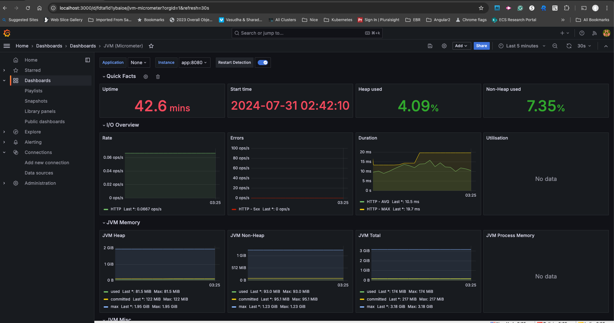
   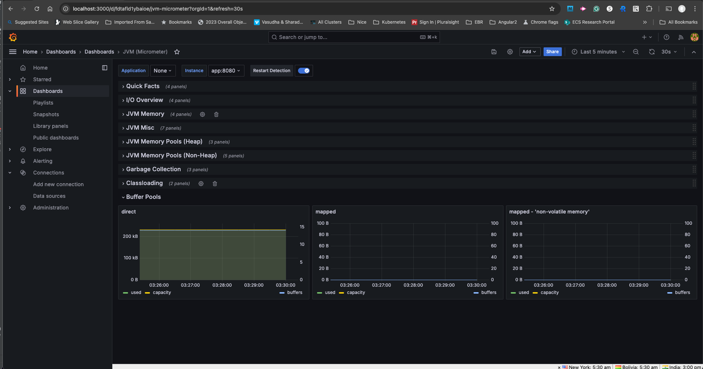
5. Open **JVM Metrics - Open Telemetery** dashboard
   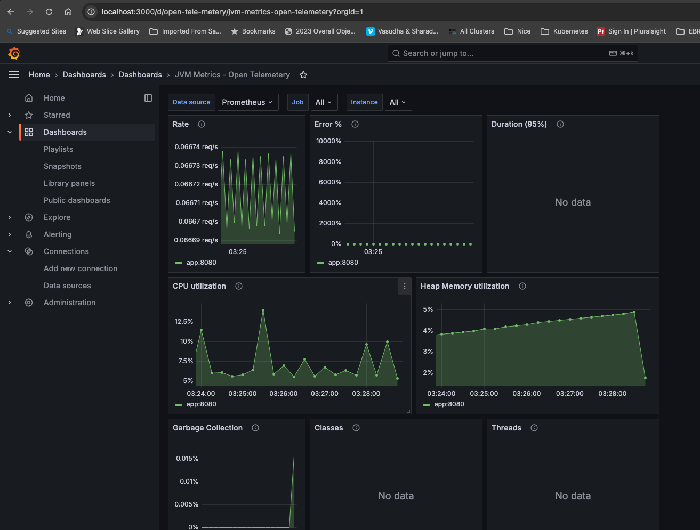
6. Open **Spring Boot 3.3 System Monitor** dashboard
   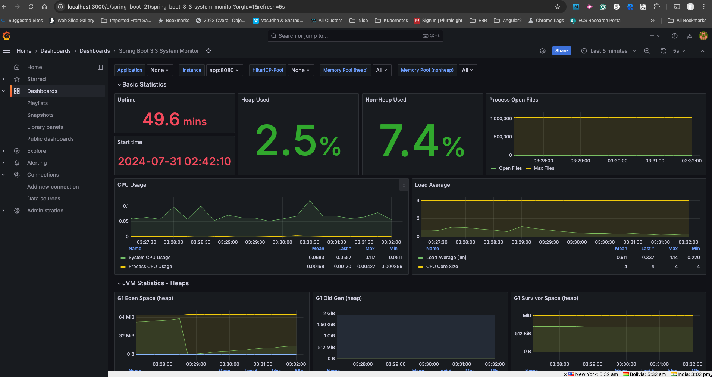
7. Open **Spring Boot Statistics & Endpoint Metrics** dashboard
   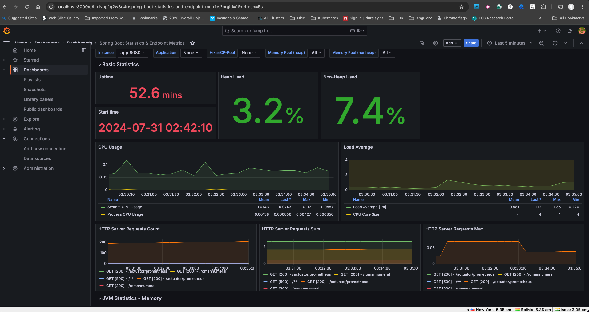

## 9. **Shutdown Service & Clean up Docker**

```bash
 ./shutDown.sh
```

- This cleans up docker-compose containers and remove orphans

## 10. **Project Files Layout**
```
number-to-roman
├── README.md
├── docker
│   ├── .env
│   ├── docker-compose.yml
│   ├── elasticsearch
│   │   ├── Dockerfile
│   │   └── elasticsearch.yml
│   ├── filebeat
│   │   ├── filebeat.yml
│   │   ├── logs
│   │   └── modules.d
│   │       └── system.yml
│   ├── grafana
│   │   └── provisioning
│   │       ├── dashboards
│   │       │   ├── dashboard.yml
│   │       │   ├── number-to-roman-dashboard.json
│   │       │   ├── open-tele-dashboard.json
│   │       │   ├── spring-boot-dashboard.json
│   │       │   └── system-monitor.json
│   │       └── datasources
│   │           └── datasource.yml
│   ├── kibana
│   │   └── config
│   │       └── kibana.yml
│   ├── logstash
│   │   ├── pipeline
│   │   │   └── logstash.conf
│   │   └── templates
│   │       └── logstash.template.json
│   ├── otel-collector
│   │   └── otel-collector-config.yaml
│   ├── prometheus
│   │   └── prometheus.yml
│   └── spring-boot
│       └── Dockerfile
├── logs
│   ├── application.log
│   └── application.log.2024-07-28.0.gz
├── maven-settings.xml
├── mvnw
├── mvnw.cmd
├── pom.xml
├── run-sonar.sh
├── screenshots
│   ├── architecture.png
│   ├── copy-token.jpeg
│   ├── create-index-logstash.jpeg
│   ├── create-index.jpeg
│   ├── docker-container.jpeg
│   ├── file-structure.txt
│   ├── generate-newtoken.jpeg
│   ├── grafana-dashboard.png
│   ├── grafana-endpoint.png
│   ├── grafana-jvm-micro-2.png
│   ├── grafana-jvm-micro.png
│   ├── grafana-otel.png
│   ├── grafana-sys-monitor.png
│   ├── kibana.png
│   ├── sonar-myaccount.jpeg
│   ├── sonar-qube.jpeg
│   ├── swagger-index.png
│   ├── swagger-query.png
│   └── swagger-range.png
├── scripts
│   ├── buildDeploy.sh
│   ├── checkDockerStatus.sh
│   ├── dockerRun.sh
│   ├── getContainerLogs.sh
│   ├── restartDocker.sh
│   ├── shutDown.sh
│   └── testRateLimiter.sh
├── sonar-project.properties
└── src
    ├── integration-test
    │   └── java
    │       └── com
    │           └── adobe
    │               └── convertor
    │                   └── integration
    │                       └── NumberToRomanIntegrationTest.java
    ├── main
    │   ├── java
    │   │   └── com
    │   │       └── adobe
    │   │           └── convertor
    │   │               ├── NumberToRomanApplication.java
    │   │               ├── bean
    │   │               │   ├── ConversionResponse.java
    │   │               │   └── ConversionResult.java
    │   │               ├── config
    │   │               │   └── SwaggerConfig.java
    │   │               ├── controller
    │   │               │   └── NumberToRomanController.java
    │   │               ├── exception
    │   │               │   ├── ConversionProcessException.java
    │   │               │   ├── ErrorDetails.java
    │   │               │   ├── GlobalExceptionHandler.java
    │   │               │   └── InvalidInputException.java
    │   │               ├── service
    │   │               │   ├── NumberToRomanService.java
    │   │               │   └── impl
    │   │               │       └── NumberToRomanServiceImpl.java
    │   │               └── validation
    │   │                   └── InputValidation.java
    │   └── resources
    │       ├── application.properties
    │       └── logback.xml
    └── test
        └── java
            └── com
                └── adobe
                    └── convertor
                        ├── NumberToRomanApplicationTest.java
                        ├── config
                        │   └── SwaggerConfigTest.java
                        ├── controller
                        │   └── NumberToRomanControllerTest.java
                        ├── service
                        │   └── impl
                        │       └── NumberToRomanServiceImplTest.java
                        └── validation
                            └── InputValidationTest.java

50 directories, 73 files


```
## 11. **References**

- [Roman Numerals](https://simple.wikipedia.org/wiki/Roman_numerals)
- [Spring Boot Documentation](https://docs.spring.io/spring-boot/docs/current/reference/htmlsingle/)
- [Grafana Documentation](https://grafana.com/docs/)
- [Grafana Setup Reference](https://keepgrowing.in/tools/grafana-provisioning-how-to-configure-data-sources-and-dashboards/)
- [Prometheus Documentation](https://prometheus.io/docs/introduction/overview/)
- [Filebeat Documentation](https://www.elastic.co/guide/en/beats/filebeat/current/index.html)
- [Elasticsearch Documentation](https://www.elastic.co/guide/en/elasticsearch/reference/current/index.html)
- [Logstash Documentation](https://www.elastic.co/guide/en/logstash/current/index.html)
- [Kibana Documentation](https://www.elastic.co/guide/en/kibana/current/index.html)
- [OpenTelemetry Documentation](https://opentelemetry.io/docs/)
- [Docker Compose Documentation](https://docs.docker.com/compose/)
- [SonarQube Documentation](https://docs.sonarqube.org/)

