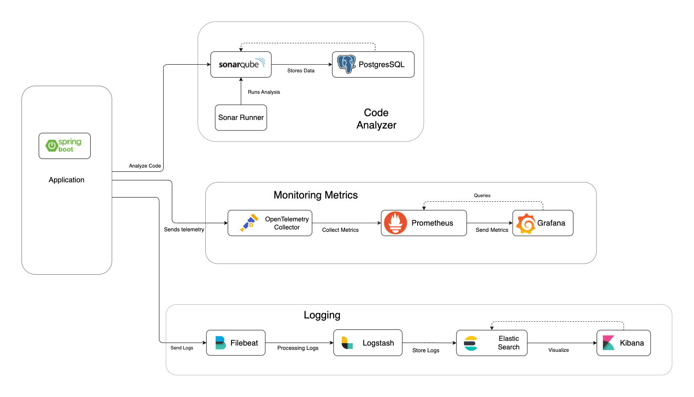

# Spring Boot - Number to Roman Conversion with Monitoring and Logging

This project demonstrates a Spring Boot application that converts numbers to Roman numerals. It supports Query and range API (1-3999). It includes monitoring and
logging integrations using Grafana, Prometheus, and the ELK (Elasticsearch, Logstash, Kibana) stack.

## **Developer**

**Name**: Jayakesavan Muthazhagan<br/>
**Contact**: kesavan.gm@gmail.com

## Table of Contents

1. [Project Architecture](#1-project-architecture)
    - 1.1 [Project overview](#11-project-overview)  
    - 1.2 [Architecture Diagram](#12-architecture-diagram)
      - 1.2.1 [Kong API Gateway](#121-kong-api-gateway)
      - 1.2.2 [Physical Architecture](#122-physical-architecture)
2. [Tech Stack and Infrastructure utilized for this project](#2-tech-stack-and-infrastructure-utilized-for-this-project)
3. [Pre-requisites](#3-pre-requisites)
4. [Install & Setup](#4-install-steps-to-set-up-project)
5. [Credentials](#5-credentials)
6. [All Service Endpoint Details](#6-all-service-endpoint-details)
7. [Junit, Integration Test and Sonarqube CodeCoverage](#7-junit-integration-test-and-sonarqube-codecoverage)
    - 7.1 [Test Scenario's](#71-test-scenarios)
    - 7.2 [Junit Testing](#72-junit-testing)
    - 7.3 [Integration Test](#73-integration-test)
    - 7.4 [Sonar Code Coverage](#74-sonar-code-coverage)
      - 7.4.1 [ Follow the steps to run the Sonar Code Coverage](#741-follow-the-steps-to-run-the-sonar-code-coverage)
      - 7.4.2 [ Alternative method to generate sonar token](#742-alternative-method-to-generate-the-token-in-sonarqube-ui-skip-this-if-the-token-has-already-been-generated)
      - 7.4.3 [Run Sonar Analysis Report](#743-run-sonar-analysis-report)
8. [Kong API & Features](#8-kong-api--features)
    - 8.1 [Test Kong API Gateway](#81-test-kong-api-gateway-with-springboot-app)
9. [Logging & Monitoring - ELK Stack](#9-logging--monitoring---elk-stack)
    - 9.1 [Kibana Dashboard](#91-kibana-dashboard)
10. [Grafana, Prometheus Dashboard & Monitoring](#10-grafana-prometheus-dashboard--monitoring-metrics)
    - 10.1 [Access Grafana](#101-access-grafana)
11. [Shutdown Service & Clean Up](#11-shutdown-service--clean-up-docker)
12. [Project File Layout](#12-project-files-layout)
13. [References](#13-references)

## 1. **Project Architecture**

### 1.1 **Project overview:**

This Spring Boot Application architecture has monitoring, logging, and continuous integration/continuous deployment (
CI/CD) using several tools.
<br/>The main components include:

* OpenTelemetry Collector: Opensource Framework for observability and collecting metrics, unified observability framework
* Prometheus: For metrics collection.
* Grafana: For visualization.
* Elasticsearch, Logstash, Kibana (ELK stack): For logging and searching.
* SonarQube: For code quality analysis.
* PostgreSQL: As a database for SonarQube.
* Spring Boot Application: The application to be monitored and analyzed.
* Sonar Runner: For running SonarQube analysis.
* Network: A common network for all services to communicate.

### 1.2 **Architecture Diagram**

### 1.2.1 **Kong API Gateway**

Kong API Gateway is an open-source tool designed to manage, secure, and monitor APIs and microservices. 


### Key Features:

1. **API Gateway**: Acts as a middleware between clients and backend services, handling requests, and responses. It can manage traffic, enforce policies, and perform various transformations.

2. **Load Balancing**: Distributes incoming traffic across multiple backend services to ensure high availability and reliability.

3. **Security**: Provides built-in security features like authentication, rate limiting, and IP whitelisting to protect your APIs from unauthorized access and abuse.

4. **Monitoring & Logging**: Integrates with monitoring and logging tools to provide insights into API usage, performance, and errors. It supports logging via various outputs like stdout, files, or external systems.

5. **Plugin Architecture**: Extensible with a rich ecosystem of plugins that add functionalities such as caching, transformations, and advanced security measures. You can also develop custom plugins.

6. **Developer Portal**: Offers a user-friendly interface for developers to explore API documentation, test endpoints, and manage their API keys.

7. **Scalability**: Designed to scale horizontally, making it suitable for handling high traffic and complex API environments.

8. **Deployment Flexibility**: Can be deployed on-premises, in the cloud, or as a managed service (Kong Cloud).

Kong helps organizations streamline their API management processes, improve security, and enhance the overall developer experience.
#### 1.2.2 **Physical Architecture**


#### **Legends**

- **OpenTelemetry Collector**: Collects telemetry data from the application.
- **Prometheus**: Collects and stores metrics.
- **Grafana**: Visualizes metrics from Prometheus.
- **Elasticsearch**: Realt-time indexing, stores logs processed by Logstash.
- **Logstash**: Data transformation, enrichment and send logs to Elasticsearch.
- **Kibana**: Visualizes logs stored in Elasticsearch.
- **Filebeat**: Ships logs to Logstash.
- **SonarQube**: Analyzes code quality.
- **PostgreSQL:** Database for SonarQube, helps admin SonarQube and Store User Data
- **Spring Boot App:** The application being monitored and analyzed .
- **Sonar Runner:** Runs SonarQube analysis on the codebase .

## 2. **Tech Stack and Infrastructure utilized for this project**
1. Spring Boot - 3.3.2
2. Maven - 3.9.8
3. OpenAPI - 2.3.0
4. Kong - 2.8.5
5. Prometheus - latest
6. Open-Telemetry - latest
7. Grafana - latest
8. Kibana - 7.17.22
9. Elasticsearch - 7.17.22
10. Logstash - 7.17.22
11. Filebeat - 7.17.22
12. Sonarqube - latest
13. Postgres (Sonarqube) - latest
14. Docker Compose - 1.29.2
15. Docker - 20.10.16


## 3. **Pre-requisites**

Before you begin, ensure you have met the following requirements:

- Docker and Docker Compose installed (Docker - 20.10.16, docker-compose version 1.29.2)

```shell
docker version
docker-compose version
```

- Java Development Kit (JDK) 17 or higher (OpenJDK 17)

```shell
java -version
```

- Maven for building the Spring Boot application (Maven - 3.9.8 , SpringBoot - 3.3.2)

```shell
mvn -v
```

- OS used to run this setup: `OS name: "mac os x", version: "12.7.5", arch: "x86_64", family: "mac"`

- Basic understanding of Spring Boot, Docker, and monitoring/logging tools

## 4. **Install steps to set up Project**
> [!NOTE]
> Before starting, please note that the installation process may take approximately 2 to 3 minutes to complete, specifically during `buildDeploy`.

1. **Clone the Repository**
    ```bash
    git clone https://github.com/jmuthazh/number-to-roman.git
    cd number-to-roman
   ```
2. **Build the project:**

    ```bash
    mvn clean install -U
    ```

3. **Build and run the Docker container:**

    ```bash
   cd scripts
   ./buildDeploy.sh
   ```

After successful docker deployment, you should see the following containers running
> [!NOTE]
> Make sure all are containers are healthy, before using the service endpoints.

```bash
./checkDockerStatus.sh
```

```sh
app              java -Djava.security.egd=f ...   Up               0.0.0.0:8080->8080/tcp                                                                            
elasticsearch    /bin/tini -- /usr/local/bi ...   Up (healthy)     0.0.0.0:9200->9200/tcp, 9300/tcp                                                                  
filebeat         /usr/bin/tini -- /usr/loca ...   Up (unhealthy)                                                                                                     
grafana          /run.sh                          Up (healthy)     0.0.0.0:3000->3000/tcp                                                                            
kibana           /bin/tini -- /usr/local/bi ...   Up (healthy)     0.0.0.0:5601->5601/tcp                                                                            
kong             /docker-entrypoint.sh kong ...   Up (healthy)     0.0.0.0:8000->8000/tcp, 127.0.0.1:8001->8001/tcp, 0.0.0.0:8443->8443/tcp, 127.0.0.1:8444->8444/tcp
logstash         /usr/local/bin/docker-entr ...   Up (healthy)     0.0.0.0:5000->5000/tcp, 0.0.0.0:5044->5044/tcp, 9600/tcp                                          
otel-collector   /otelcol --config /etc/ote ...   Up (healthy)   0.0.0.0:13133->13133/tcp, 0.0.0.0:4317->4317/tcp, 55678/tcp, 55679/tcp, 0.0.0.0:55681->55681/tcp  
prometheus       /bin/prometheus --config.f ...   Up (healthy)     0.0.0.0:9090->9090/tcp                                                                            
sonar-runner     /usr/local/bin/mvn-entrypo ...   Exit 0                                                                                                             
sonarqube        /opt/sonarqube/docker/entr ...   Up (healthy)     0.0.0.0:9000->9000/tcp                                                                            
sonarqube-db     docker-entrypoint.sh postgres    Up (healthy)     5432/tcp                                                                                          

```

> [!IMPORTANT]
> If you encounter issues with your container not starting or showing errors like this shown below, make sure to run the `./builDeploy.sh`
script from the `/scripts` folder repeatedly until the problem is resolved.
```shell
ERROR: for app  Container "da423aaae8e0" is unhealthy.
ERROR: Encountered errors while bringing up the project.

```
## 5. **Credentials**

1. **Conversion Service**: http://localhost:8000/romannumeral?query=400 (admin/SuperSecretPass123)
2. **Grafana**: http://localhost:3000 (admin/admin)
2. **Sonar Qube**: http://localhost:9000/ (admin/admin)

## 6. **All Service Endpoint Details**

- **Conversion Service Endpoint**
    - Credential to consume this service: `admin/SuperSecretPass123`
    - **Swagger:** http://localhost:8080/swagger-ui/index.html
      
        1. Query API: http://localhost:8080/romannumeral?query=200
        ```shell
        {
        "input": "200",
        "output": "CC"
        }
        ``` 

      
        2. Range API:  http://localhost:8080/romannumeral?min=1&max=3
        ```shell
        {
        "conversions": [
        {
        "input": "1",
        "output": "I"
        },
        {
        "input": "2",
        "output": "II"
        },
        {
        "input": "3",
        "output": "III"
        }
        ]
        }
        ```
      

        - **Conversion Service API (Exposed via Kong Gateway):**
            - **API for Number:** http://localhost:8000/romannumeral?query=400
            - **API for Range:** http://localhost:8000/romannumeral?min=5&max=100

       [Note:] Number Range should be from min: >=1, max <= 3999)
    - **Spring Metrics**
        - Spring Actuator: http://localhost:8080/actuator
        - Prometheus: http://localhost:8080/actuator/prometheus
- **Kong Admin API**:
  - Services: http://localhost:8001/services
  - Routes: http://localhost:8001/services/app/routes
  - Rate Limit Plugin: http://localhost:8001/services/app/plugins
- **Kibana**: http://localhost:5601/
- **Grafana**: http://localhost:3000 (admin/admin)
- **ElasticSearch**: http://localhost:9200/
- **Log Stash**: http://localhost:9600/_node/stats
- **Sonar Qube**: http://localhost:9000/ (admin/admin)
- **Prometheus**: http://localhost:9090/

## 7. **Junit, Integration Test and Sonarqube CodeCoverage**

### 7.1 **Test Scenario's**

1. Positive Input:

- http://localhost:8080/romannumeral?query=20
```json
{
    "input": "20",
    "output": "XX"
}
``` 

2. Negative Input:

- http://localhost:8080/romannumeral?query=-11

```json
{
  "statusCode": 400,
  "message": "Number out of range (1-3999): -11",
  "details": "uri=/romannumeral"
}
```

3. Invalid Input:

- http://localhost:8080/romannumeral?query=4000L

```json
{
  "statusCode": 400,
  "message": "Invalid number format: 4000L",
  "details": "uri=/romannumeral"
}
```

3. Positive Range:

- http://localhost:8080/romannumeral?min=3995&max=3999

```json
{
  "conversions": [
    {
      "input": "3995",
      "output": "MMMCMXCV"
    },
    {
      "input": "3996",
      "output": "MMMCMXCVI"
    },
    {
      "input": "3997",
      "output": "MMMCMXCVII"
    },
    {
      "input": "3998",
      "output": "MMMCMXCVIII"
    },
    {
      "input": "3999",
      "output": "MMMCMXCIX"
    }
  ]
}
```

4. Out of Range:

- http://localhost:8080/romannumeral?min=1&max=4000

```json
{
  "statusCode": 400,
  "message": "Invalid range. Ensure min < max and both are in the range 1-3999.",
  "details": "uri=/romannumeral"
}
```

5. High min & Low Max Range:

- http://localhost:8080/romannumeral?min=45&max=40

```json
{
  "statusCode": 400,
  "message": "Invalid range. Ensure min < max and both are in the range 1-3999.",
  "details": "uri=/romannumeral"
}
```

6. Text Input:
- http://localhost:8080/romannumeral?min=1df&max=10
```json
{
  "statusCode": 500,
  "message": "Failed to convert value of type 'java.lang.String' to required type 'java.lang.Integer'; For input string: \"1df\"",
  "details": "uri=/romannumeral"
}
```
7. Number as String:
- http://localhost:8080/romannumeral?min="1"&max="10"
```json
{
  "statusCode": 500,
  "message": "Failed to convert value of type 'java.lang.String' to required type 'java.lang.Integer'; For input string: \"\"1\"\"",
  "details": "uri=/romannumeral"
}
```
8. Number and String:
- http://localhost:8080/romannumeral?min=1&max=string
```json
{
  "statusCode": 500,
  "message": "Failed to convert value of type 'java.lang.String' to required type 'java.lang.Integer'; For input string: \"string\"",
  "details": "uri=/romannumeral"
}
```
9. Query Input as String:
- http://localhost:8080/romannumeral?query="100"
```json
{
  "statusCode": 400,
  "message": "Invalid number format: \"100\"",
  "details": "uri=/romannumeral"
}
```
### 7.2 **Junit Testing**

* [NumberToRomanServiceImplTest.java](src/test/java/com/adobe/convertor/service/impl/NumberToRomanServiceImplTest.java) 
  - This test class verifies `NumberToRomanController` endpoints using `MockMvc`, including **valid** and **invalid** conversions, **error** **handling**, and **parameter checks**, ensuring the controller interacts correctly with NumberToRomanService.
* [NumberToRomanControllerTest.java](src/test/java/com/adobe/convertor/controller/NumberToRomanControllerTest.java) :
  - This test class verifies the `NumberToRomanController` using `MockMvc` to ensure correct handling of conversion requests. It tests **valid** and **invalid** conversions, checks error handling for **invalid inputs and ranges,** and **verifies** that the service methods are called as expected.
* [InputValidationTest.java](src/test/java/com/adobe/convertor/validation/InputValidationTest.java)
   - This test class verifies the `InputValidation` utility:
    
     - **Private Constructor**: Ensures the class cannot be instantiated via a private constructor.
     - **Single Number Validation**: Tests **valid** and **invalid** inputs for single numbers, checking proper **exception handling**.
     - **Range Validation:** Tests **valid** and **invalid** ranges, ensuring correct exception handling for out-of-bounds values.
     - **Text Parsing**: **Validates** and **parses** text inputs, ensuring exceptions are thrown for **invalid formats** and **out-of-range** values.
- [NumberToRomanApplicationTest.java](src/test/java/com/adobe/convertor/NumberToRomanApplicationTest.java):
  - This test class verifies that the Spring Boot application context loads successfully. It checks if the application starts without any issues.
- [SwaggerConfigTest.java](src/test/java/com/adobe/convertor/config/SwaggerConfigTest.java):
  - This test class verifies the configuration of Swagger API documentation:

    - **Custom OpenAPI Configuration:** Tests the `customOpenAPI` method of `SwaggerConfig` to ensure it returns a properly configured `OpenAPI` object.
    - **Assertions:** Checks that the `OpenAPI` object is not null and contains correct title, version, and description values.
- [SecurityConfigTest.java](src/test/java/com/adobe/convertor/security/SecurityConfigTest.java):
  - This test class checks the security configuration:

    * **Actuator Endpoint:** Ensures the /actuator/health endpoint is accessible without authentication.
    * **Protected Endpoint:** Confirms that the /romannumeral endpoint requires authentication.
    * **Authenticated Access:** Verifies that authenticated users can access the /romannumeral endpoint.

### 7.3 **Integration Test**

- This test runs the end to end integration test and pass actual values to the service.
  -[NumberToRomanIntegrationTest.java](src/test/java/com/adobe/convertor/integration/NumberToRomanIntegrationTest.java)

### 7.4 **Sonar Code Coverage**

#### 7.4.1 **Follow the steps to run the Sonar Code Coverage**

1. Login into **SonarQube**: http://localhost:9000/ (admin/admin)
2. **Password Change:**
   - If SonarQube prompts you to change your password, update it to `Sonare@123`. This password should match the one specified in the `docker/.env` file.
   - If you choose a different password, be sure to update the `.env` file accordingly.

3. **Generate** the **sonar token** after changing the password and update the values in `docker/.env` file
```shell
curl -u admin:Sonar@123 -X POST "http://localhost:9000/api/user_tokens/generate?name=test-token"
```

- After a successful execution of above CURL, you should see output similar to the following. Copy the token value and save it in the `docker/.env` file.
```shell
{"login":"admin","name":"test-token","token":"dfdfdsfs123456777777dfsfdfdfsdfsdffsdfsdf","createdAt":"2024-08-02T07:07:51+0000","type":"USER_TOKEN"}%
```
    


> **Note:** if you have already generated the token, you can skip the following step.
####  7.4.2 **Alternative Method to Generate the Token in SonarQube UI (Skip this if the token has already been generated)**
 
1. Login with same credential as above.  http://localhost:9000/ (admin/Sonar@123)
5. Go to http://localhost:9000/account/security
4. Generate Sonar Qube Token as follows: Enter ***Name, Type, Project, Expires***
   
5. Copy the generated token and save it in the [.env](docker/.env) file located at `docker/.env`. 

    ```bash
    SONAR_TOKEN=<token>
    SONAR_USER=admin
    SONAR_PASSWORD=Sonar@123
    ```

  
   


### 7.4.3 **Run Sonar Analysis Report**

**Steps to Run the Script and Verify Docker Status**
1. **Run the Initial Script:**

   * Execute the script `./restartDocker.sh` once to pass the generated token and new password to SonarQube.
   * Wait for 1 to 3 minutes for the `sonar-runner` state to show `Exit 0`.
   ```shell
    sonar-runner               /usr/local/bin/mvn-entrypo ...   Exit 0
    ```
2. **Verify the Container Status:**

   * Check the status by running `./checkDockerStatus.sh` to see if the container has exited.
3. **If the Container is Stuck:**
   * If you see the status `Creating <container>` for a long time, press `Ctrl+C` to exit.
   * Then, run `./buildDeploy.sh` repeatedly until all containers show UP status.

```shell
Creating grafana                 ... done
Creating filebeat                ... done
Creating sonar-runner            ... done

ERROR: for app  Container "df0d52428f08" is unhealthy.
ERROR: Encountered errors while bringing up the project.

```
> **Note:** If the Sonar reports are not visible under `Projects > number-to-roman`, repeatedly running `./buildDeploy.sh` until the `sonar-runner` status shows `Up`.

* To check logs in `sonar-runner`, execute this command
```shell
docker logs --follow sonar-runner
```
> [!NOTE]
> The execution of `mvn verify sonar:sonar` will be displayed. This process should conclude with `BUILD SUCCESS` at the end. The build typically takes approximately 3 to 5 minutes to complete.


```shell
sonar-runner               /usr/local/bin/mvn-entrypo ...   Exit 0  
```
2. To view Code Coverage Report:
   
   Go to: http://localhost:9000/dashboard?id=number-to-roman&codeScope=overall
  


## 8. **Kong API & Features**
Kong allows to configure the following features:
* **Services and Routes**
```mermaid
<pre class="mermaid"> 
flowchart LR
  A(API client)
  B("`Route 
  (/mock)`")
  C("`Service
  (example_service)`")
  D(Upstream 
  application)
  
  A &lt;--requests
  responses--&gt; B
  subgraph id1 ["`
  **KONG GATEWAY**`"]
    B &lt;--requests
    responses--&gt; C
  end
  C &lt;--requests
  responses--&gt; D

  style id1 rx:10,ry:10
  
  </pre>
```

* **Rate Limiting** ( Global rate limit, Service level rate limit, Route level rate limit)
* **Proxy caching** (Cache response based on config, Global, Entery-level proxy cache)
* **Key Authentication** (Key Auth, Basic Auth, OAuth, LDAP, OpenID connect)
* **Load Balancing**
  
### 8.1 **Test Kong API Gateway with Springboot App**:
- **Run** the below shell script it will test the rate limit of the spring boot app. It will hit the following endpoint for 110 times and 429 Status code will be return when it goes above 100 request per minute. 
- Other configuration also include : 5 request per second and 1000 request per hour. When you hit more than 5 request per second, it will block the ip address and send **429** status.
```shell
./testRateLimiter.sh

Output: Shows http status code ( Ran 110 times here)

Sending request #1...
Response status code: 200
Sending request #2...
Response status code: 200
Sending request #3...
Response status code: 200
.
.
.
.
Sending request #108...
Response status code: 429
Sending request #109...
Response status code: 429
Sending request #110...
Response status code: 429
Test completed.
jayakesavanmuthazhagan@Jayakesavans-MacBook-Pro-2 scripts % 

```

## 9. **Logging & Monitoring - ELK Stack**

### 9.1 **Kibana Dashboard**

> [!IMPORTANT] 
> Invoke the Conversion Service API at least three times using the following URL: `http://localhost:8080/romannumeral?query=20`. Afterward, check the Kibana dashboard to verify if any data is displayed.


1. Login into Kibana http://localhost:5601/
2. Navigate to this path: http://localhost:5601/app/management/kibana/indexPatterns
3. Click on ***Create index pattern***
   
4. Enter the name as `logstash-*` and select Timestamp field as `@timestamp` , click on Create Index pattern.
   Follow the sequence in the screenshot
   
5. Navigate to this url to view Dashboard : http://localhost:5601/app/discover
6. **Kibana Dashboard View**
   

## 10. **Grafana, Prometheus Dashboard & Monitoring Metrics**

### 10.1 **Access Grafana**

1. Login into http://localhost:3000
2. UserId: admin , Password: admin
3. Navigate to the `/Dashboards` folder on the left side and look for the `Dashboards` folder within it.

> [!IMPORTANT]
> ***[ Home >   Dashboards >   Dashboards ]***


4. Open **JVM Micrometer** dashboard
   
   
5. Open **JVM Metrics - Open Telemetery** dashboard
   
6. Open **Spring Boot 3.3 System Monitor** dashboard
   
7. Open **Spring Boot Statistics & Endpoint Metrics** dashboard
   

## 11. **Shutdown Service & Clean up Docker**

```bash
 ./shutDown.sh
```

- This cleans up docker-compose containers and remove orphans

## 12. **Project Files Layout**
```shell
number-to-roman
├── README.md
├── docker
│   ├── .env
│   ├── docker-compose.yml
│   ├── elasticsearch
│   │   ├── Dockerfile
│   │   └── elasticsearch.yml
│   ├── filebeat
│   │   ├── filebeat.yml
│   │   └── modules.d
│   │       └── system.yml
│   ├── grafana
│   │   └── provisioning
│   │       ├── dashboards
│   │       │   ├── dashboard.yml
│   │       │   ├── number-to-roman-dashboard.json
│   │       │   ├── open-tele-dashboard.json
│   │       │   ├── spring-boot-dashboard.json
│   │       │   └── system-monitor.json
│   │       └── datasources
│   │           └── datasource.yml
│   ├── kibana
│   │   └── config
│   │       └── kibana.yml
│   ├── kong
│   │   └── kong.yml
│   ├── logstash
│   │   ├── pipeline
│   │   │   └── logstash.conf
│   │   └── templates
│   │       └── logstash.template.json
│   ├── otel-collector
│   │   └── otel-collector-config.yaml
│   ├── prometheus
│   │   └── prometheus.yml
│   └── spring-boot
│       └── Dockerfile
├── maven-settings.xml
├── mvnw
├── mvnw.cmd
├── pom.xml
├── run-sonar.sh
├── screenshots
│   ├── api-gateway.png
│   ├── architecture.png
│   ├── copy-token.jpeg
│   ├── create-index-logstash.jpeg
│   ├── create-index.jpeg
│   ├── docker-container.jpeg
│   ├── file-structure.txt
│   ├── generate-newtoken.jpeg
│   ├── grafana-dashboard.png
│   ├── grafana-endpoint.png
│   ├── grafana-jvm-micro-2.png
│   ├── grafana-jvm-micro.png
│   ├── grafana-otel.png
│   ├── grafana-sys-monitor.png
│   ├── kibana.png
│   ├── loadbalance.png
│   ├── sonar-myaccount.jpeg
│   ├── sonar-qube.png
│   ├── sonar-token-gen.jpeg
│   ├── swagger-index.png
│   ├── swagger-query.png
│   └── swagger-range.png
├── scripts
│   ├── buildDeploy.sh
│   ├── checkDockerStatus.sh
│   ├── logs.sh
│   ├── restartDocker.sh
│   ├── shutDown.sh
│   └── testRateLimiter.sh
├── sonar-project.properties
└── src
    ├── main
    │   ├── java
    │   │   └── com
    │   │       └── adobe
    │   │           └── convertor
    │   │               ├── NumberToRomanApplication.java
    │   │               ├── bean
    │   │               │   ├── ConversionResponse.java
    │   │               │   └── ConversionResult.java
    │   │               ├── config
    │   │               │   └── SwaggerConfig.java
    │   │               ├── controller
    │   │               │   └── NumberToRomanController.java
    │   │               ├── exception
    │   │               │   ├── ConversionProcessException.java
    │   │               │   ├── ErrorDetails.java
    │   │               │   ├── GlobalExceptionHandler.java
    │   │               │   └── InvalidInputException.java
    │   │               ├── security
    │   │               │   └── SecurityConfig.java
    │   │               ├── service
    │   │               │   ├── NumberToRomanService.java
    │   │               │   └── impl
    │   │               │       └── NumberToRomanServiceImpl.java
    │   │               └── validation
    │   │                   └── InputValidation.java
    │   └── resources
    │       ├── application.properties
    │       └── logback.xml
    └── test
        └── java
            └── com
                └── adobe
                    └── convertor
                        ├── NumberToRomanApplicationTest.java
                        ├── config
                        │   └── SwaggerConfigTest.java
                        ├── controller
                        │   └── NumberToRomanControllerTest.java
                        ├── integration
                        │   └── NumberToRomanIntegrationTest.java
                        ├── security
                        │   └── SecurityConfigTest.java
                        ├── service
                        │   └── impl
                        │       └── NumberToRomanServiceImplTest.java
                        └── validation
                            └── InputValidationTest.java

46 directories, 76 files

```
## 13. **References**

- [Roman Numerals](https://simple.wikipedia.org/wiki/Roman_numerals)
- [Spring Boot Documentation](https://docs.spring.io/spring-boot/docs/current/reference/htmlsingle/)
- [Grafana Documentation](https://grafana.com/docs/)
- [Grafana Setup Reference](https://keepgrowing.in/tools/grafana-provisioning-how-to-configure-data-sources-and-dashboards/)
- [Prometheus Documentation](https://prometheus.io/docs/introduction/overview/)
- [Filebeat Documentation](https://www.elastic.co/guide/en/beats/filebeat/current/index.html)
- [Elasticsearch Documentation](https://www.elastic.co/guide/en/elasticsearch/reference/current/index.html)
- [Logstash Documentation](https://www.elastic.co/guide/en/logstash/current/index.html)
- [Kibana Documentation](https://www.elastic.co/guide/en/kibana/current/index.html)
- [OpenTelemetry Documentation](https://opentelemetry.io/docs/)
- [Docker Compose Documentation](https://docs.docker.com/compose/)
- [SonarQube Documentation](https://docs.sonarqube.org/)
- [Kong Documentation](https://docs.konghq.com/gateway/latest/)

